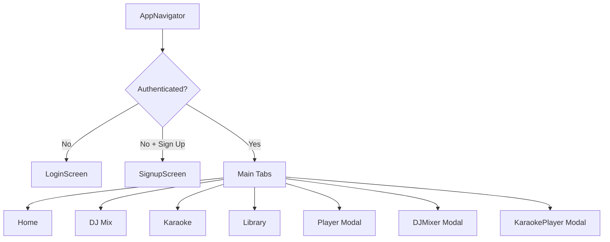

# Aara Music - Development Guide

## 🎯 Getting Started

### First Time Setup

1. **Install Dependencies**
   ```bash
   npm install
   ```

2. **Start Development Server**
   ```bash
   npm start
   ```

3. **Run on Device/Emulator**
   - Press `i` for iOS simulator
   - Press `a` for Android emulator
   - Scan QR code with Expo Go app on your phone

## 📱 Testing on Physical Device

1. Install **Expo Go** from App Store (iOS) or Play Store (Android)
2. Run `npm start` in your terminal
3. Scan the QR code that appears
4. The app will load on your device

## 🏗️ Architecture Overview

### State Management
- **MusicPlayerContext**: Global music player state using React Context
- Location: `src/context/MusicPlayerContext.tsx`
- **AuthContext**: Session restore, login/signup/logout, and current user state
- Location: `src/context/AuthContext.tsx`

### Navigation Structure


### API + Playback Flow
```mermaid
flowchart LR
   UI[Screen / Component] --> MS[musicService.ts]
   MS --> PX[Express Proxy]

   PX --> API[/api/* to Deezer]
   PX --> AUD[/audio url proxy]
   PX --> LYR[/lyrics/*]

   API --> DZ[api.deezer.com]
   AUD --> CDN[Deezer preview CDN]
   LYR --> LO[lyrics.ovh]

   UI --> MPC[MusicPlayerContext]
   MPC --> WEB[HTML5 Audio engine web]
   MPC --> NATIVE[expo-av engine native]
```

### Key Features

#### 🎵 Audio Playback
- Uses `expo-av` for audio handling
- Background audio support configured
- Queue management with next/previous controls
- Shuffle and repeat modes

#### 🎨 UI Components
- **SongCard**: Grid view for songs
- **SongListItem**: List view for songs
- **MiniPlayer**: Bottom mini player bar

## 🔧 Customization

### Changing Colors
Edit `src/constants/theme.ts`:
```typescript
export const colors = {
  primary: '#FF1744',  // Your brand color
  background: '#000000',
  // ... more colors
};
```

### Adding New Screens
1. Create screen in `src/screens/`
2. Add to navigation in `src/navigation/AppNavigator.tsx`
3. Export from `src/screens/index.ts`

### Adding Mock Data
Edit `src/data/mockData.ts` to add more songs, playlists, or albums

## 🚀 Building for Production

### iOS

1. **Install EAS CLI**
   ```bash
   npm install -g eas-cli
   ```

2. **Login to Expo**
   ```bash
   eas login
   ```

3. **Configure Build**
   ```bash
   eas build:configure
   ```

4. **Build for iOS**
   ```bash
   eas build --platform ios
   ```

5. **Submit to App Store**
   ```bash
   eas submit --platform ios
   ```

### Android

1. **Build APK/AAB**
   ```bash
   eas build --platform android
   ```

2. **Submit to Play Store**
   ```bash
   eas submit --platform android
   ```

## 🔐 Adding Firebase

1. **Install Firebase**
   ```bash
   npm install firebase
   ```

2. **Create Firebase Project**
   - Go to https://console.firebase.google.com
   - Create new project
   - Enable Authentication, Firestore, Storage

3. **Configure Firebase**
   - Copy your config from Firebase Console
   - Update `src/config/firebase.ts`
   - Uncomment the code

4. **Use Firebase Services**
   ```typescript
   import { auth, db, storage } from './src/config/firebase';
   ```

## 📦 Key Dependencies Explained

- **@react-navigation/native**: Core navigation library
- **@react-navigation/bottom-tabs**: Bottom tab navigation
- **@react-navigation/native-stack**: Stack navigation for modals
- **expo-av**: Audio/video playback
- **expo-linear-gradient**: Gradient UI effects
- **@expo/vector-icons**: Icon library (Ionicons)
- **react-native-safe-area-context**: Safe area handling
- **react-native-screens**: Native navigation performance

## 🐛 Common Issues

### App not loading on device
- Make sure device and computer are on same WiFi
- Try refreshing the Expo Go app
- Run `expo start -c` to clear cache

### Audio not playing
- Check that audio URLs are valid
- Verify internet connection
- Check device volume settings

### Build errors
- Run `npm install` to ensure dependencies are installed
- Clear cache: `expo start -c`
- Delete node_modules and reinstall: `rm -rf node_modules && npm install`

## 📚 Next Steps

### Recommended Features to Add

1. **User Authentication**
   - Sign up / Login with email
   - Social login (Google, Apple)
   - User profiles

2. **Cloud Storage**
   - Store user playlists in Firestore
   - Sync across devices
   - Upload custom music

3. **Advanced Player Features**
   - Lyrics display
   - Sleep timer
   - Audio equalizer
   - Crossfade between songs

4. **Social Features**
   - Share songs/playlists
   - Collaborative playlists
   - Follow other users
   - Activity feed

5. **Offline Mode**
   - Download songs for offline playback
   - Cache management
   - Offline-first architecture

6. **Music Discovery**
   - AI recommendations
   - Radio mode
   - Trending charts
   - Personalized daily mixes

## 📖 Resources

- [Expo Documentation](https://docs.expo.dev)
- [React Navigation](https://reactnavigation.org)
- [React Native Docs](https://reactnative.dev)
- [Firebase Docs](https://firebase.google.com/docs)

## 💡 Tips

- Use `console.log()` for debugging
- Install React DevTools for better debugging
- Use Expo's hot reload for faster development
- Test on both iOS and Android regularly
- Keep dependencies updated

## 🎨 Design Inspiration

This app's design is inspired by:
- Apple Music - Clean, elegant interface
- YouTube Music - Discovery and recommendations
- Spotify - Playlist management

Feel free to customize and make it your own!

---

Happy Coding! 🚀
